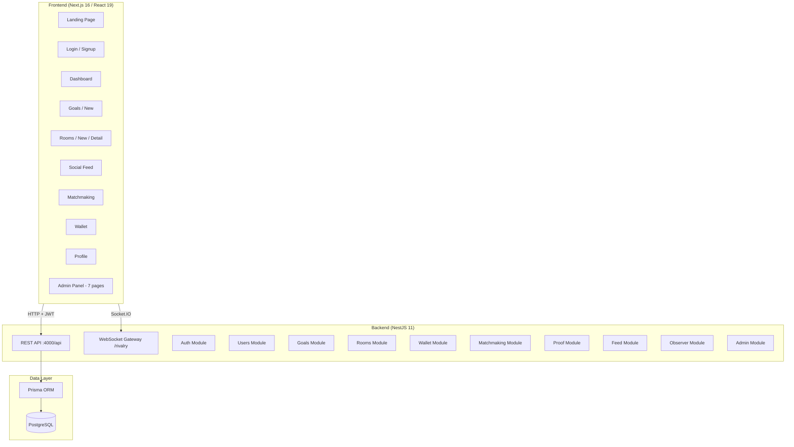

# Rivalry — Full Codebase Assessment

## What Is Rivalry?

**Rivalry** is a **rival-based goal accountability platform** where users set personal goals, get matched with rivals pursuing similar targets, deposit money/credits as stakes, follow structured roadmaps with milestones, submit proof of progress, and compete for prize pools. Think "Duolingo meets sports betting for self-improvement."

---

## Architecture Overview



---

## Tech Stack Summary

| Layer | Technology | Version |
|-------|-----------|---------|
| Frontend | Next.js (App Router) | 16.1.6 |
| Frontend | React | 19.2.3 |
| Backend | NestJS | 11.x |
| ORM | Prisma Client | 7.4.1 |
| Database | PostgreSQL | via `pg` |
| Auth | JWT + Passport + bcrypt | — |
| Real-time | Socket.IO | 4.8.3 |
| Styling | Vanilla CSS (dark glassmorphism) | — |
| Deployment | Vercel (backend) | — |

---

## Backend Modules (12 total)

| Module | Key Endpoints | Lines | Status |
|--------|-------------|-------|--------|
| **Auth** | signup, login, me | ~75 | ✅ Working |
| **Users** | profile, follow/unfollow, search, stats | ~123 | ✅ Working |
| **Goals** | CRUD goals with categories | ~50 | ✅ Working |
| **Rooms** | create, join, activate, complete, list, my-rooms | ~340 | ✅ Core logic done |
| **Wallet** | top-up, deposit, withdraw, tip, prize distribution | ~135 | ✅ Working |
| **Matchmaking** | find rivals by skill/goals, invites | ~88 | ✅ Basic impl |
| **Proof** | submit proof, auto-progress, auto-complete | ~82 | ✅ Working |
| **Feed** | posts, comments, explore, followed feed | ~73 | ✅ Working |
| **Observer** | watch rooms, tip, list observers | ~56 | ✅ Working |
| **Gateway** | WebSocket room join/leave, notifications | ~61 | ⚠️ Scaffold only |
| **Admin** | dashboard, user/room/transaction mgmt, analytics, audit | ~383 | ✅ Comprehensive |
| **Prisma** | DB service wrapper | — | ✅ Working |

## Database Schema (16 models)

| Model | Purpose |
|-------|---------|
| `User` | Core user with email, username, role, status |
| `Profile` | Extended stats: wins, losses, reputation, skill level |
| `Follow` | Social graph relationships |
| `Wallet` | User balance + frozen state |
| `Transaction` | All financial movements |
| `Goal` | User goals with category, type, difficulty, timeline |
| `Room` | Competition rooms with status, prize pool, proof type |
| `Participant` | Room membership with progress tracking |
| `Roadmap` | Auto-generated structured plan per room |
| `Milestone` | Weekly objectives within a roadmap |
| `Substep` | Granular tasks within milestones |
| `ProofSubmission` | Evidence uploads for milestone completion |
| `RoomFeedItem` | Activity stream within rooms |
| `Post` / `Comment` | Global social feed |
| `Observer` | Spectators watching rooms |
| `MatchInvite` | Challenge invitations between users |
| `Interest` | Master data for categories |
| `AdminAuditLog` | Admin action tracking |
| `SystemSettings` | Key-value platform config |

## Frontend Pages (15 routes)

| Route | Description |
|-------|-------------|
| `/` | Landing page with hero, stats, how-it-works, categories, CTA |
| `/login` | Email/password login |
| `/signup` | Registration form |
| `/dashboard` | User dashboard |
| `/goals/new` | Create new goal |
| `/rooms` | Browse competition rooms |
| `/rooms/new` | Create a room |
| `/rooms/[id]` | Room detail with roadmap, leaderboard, feed |
| `/feed` | Social feed |
| `/matchmaking` | Find rivals |
| `/wallet` | Balance, top-up, withdraw, transaction history |
| `/profile/[id]` | User profile |
| `/admin/*` | 7 admin sub-pages (dashboard, users, rooms, transactions, interests, analytics, audit, system settings) |

---

## What's Working Well ✅

1. **Comprehensive data model** — 16 well-designed Prisma models cover the full product vision
2. **Good design system** — 767-line CSS with design tokens, glassmorphism, responsive mobile/desktop layouts, animations, dark mode
3. **Complete API surface** — The [api.ts](file:///c:/Users/LENOVO/Documents/GitHub/rivalry/frontend/src/lib/api.ts) client covers ~50+ endpoints
4. **Admin panel** — Fully featured with dashboard stats, user management, room management, transaction oversight, interest CRUD, analytics, audit logs, and system settings
5. **Room lifecycle** — Full flow from creation → join → activate → roadmap generation → proof submission → auto-completion → prize distribution
6. **Seed data** — Robust 356-line seed file creates 100 users, 100 rooms, 200 transactions, 50 posts, 150 follow relationships, and 20 interests
7. **Auth flow** — JWT-based with access + refresh tokens, bcrypt password hashing, role-based guards
8. **Matchmaking** — Smart scoring algorithm considering shared goals, skill level distance, and activity

---

## Areas for Improvement 🔧

### 🔴 Critical Issues

#### 1. Security: Hardcoded JWT Secret Fallback
In [auth.module.ts](file:///c:/Users/LENOVO/Documents/GitHub/rivalry/backend/src/auth/auth.module.ts#L16):
```typescript
secret: config.get('JWT_SECRET') || 'rivalry-secret-key-change-in-production'
```
If `JWT_SECRET` is not set, the app falls back to a known hardcoded secret. This should **throw an error** instead.

#### 2. Security: TLS Verification Disabled
In [seed.ts](file:///c:/Users/LENOVO/Documents/GitHub/rivalry/backend/prisma/seed.ts#L9):
```typescript
process.env.NODE_TLS_REJECT_UNAUTHORIZED = '0';
```
While this is in the seed file, it's a dangerous pattern that could leak into production.

#### 3. No Database Transactions for Financial Operations
The [wallet.service.ts](file:///c:/Users/LENOVO/Documents/GitHub/rivalry/backend/src/wallet/wallet.service.ts) performs balance checks and updates in separate queries without wrapping them in a database transaction. This creates race conditions where concurrent requests could result in negative balances or double-spending.

#### 4. WebSocket Gateway Has No Authentication
The [rivalry.gateway.ts](file:///c:/Users/LENOVO/Documents/GitHub/rivalry/backend/src/gateway/rivalry.gateway.ts) accepts any `userId` sent via the `authenticate` event without verifying the JWT token. Anyone can impersonate another user.

#### 5. WebSocket CORS Set to Wildcard
```typescript
cors: { origin: '*' }
```
This should match the REST API's CORS configuration.

---

### 🟡 Architectural Improvements

#### 6. Duplicate Root `src/` Directory
The root-level [src/](file:///c:/Users/LENOVO/Documents/GitHub/rivalry/src) and [test/](file:///c:/Users/LENOVO/Documents/GitHub/rivalry/test) directories contain default NestJS scaffold files (`app.controller.ts`, `app.service.ts`, etc.) that are **not used**. These should be deleted to avoid confusion.

#### 7. Default README
The [README.md](file:///c:/Users/LENOVO/Documents/GitHub/rivalry/README.md) is still the auto-generated NestJS boilerplate. It should describe the Rivalry project, setup instructions, architecture, and team info.

#### 8. No `.env.example` File
There's no `.env.example` documenting required environment variables (`DATABASE_URL`, `JWT_SECRET`, `CORS_ORIGIN`, `PORT`, etc.). This makes onboarding difficult.

#### 9. No Monorepo Tooling
The `backend/` and `frontend/` are separate npm projects with no workspace configuration (no root `package.json`, no npm/pnpm/yarn workspaces). Consider adding a root `package.json` with workspace links and shared scripts (`dev`, `build`, `lint`).

#### 10. Missing Error Handling Patterns
- API client [api.ts](file:///c:/Users/LENOVO/Documents/GitHub/rivalry/frontend/src/lib/api.ts) has basic error handling but no retry logic or request queuing
- No global error boundary in the frontend
- No rate limiting on the backend

#### 11. `any` Types Everywhere
Both the frontend and backend use `any` extensively:
- `AuthContext.tsx`: `profile?: any`, `wallet?: any`
- `api.ts`: Almost every method returns `Promise<any>`
- Service methods often use `any` for parameters

This eliminates TypeScript's primary benefit. Define proper interfaces/DTOs.

---

### 🟢 Feature & Polish Improvements

#### 12. WebSocket Gateway Is Not Integrated
The [RivalryGateway](file:///c:/Users/LENOVO/Documents/GitHub/rivalry/backend/src/gateway/rivalry.gateway.ts) has `notifyRoomUpdate()` and `notifyUser()` methods, but **no service actually calls them**. Room events (join, proof submission, completion) should emit real-time updates.

#### 13. Proof Submissions Are Auto-Approved
In [proof.service.ts](file:///c:/Users/LENOVO/Documents/GitHub/rivalry/backend/src/proof/proof.service.ts#L28):
```typescript
status: 'approved', // Auto-approve for MVP
```
There's no peer review or observer voting mechanism yet. This is a key differentiator — consider implementing it.

#### 14. No File Upload Infrastructure
The `multer` package is installed but there's no file upload endpoint. Proof submissions reference `fileUrl` but users can only submit text/links.

#### 15. Google OAuth Not Connected
The `passport-google-oauth20` package is installed and typed but there's no Google strategy implementation. The auth module only has a JWT strategy.

#### 16. No Notification System
- No email notifications (room joined, invite received, room completed)
- No push notifications
- No in-app notification center

#### 17. No Room Timer / Scheduler
Rooms have `endDate` but there's no cron job or scheduler to auto-complete rooms when their deadline passes. If nobody submits proof, rooms just stay "active" forever.

#### 18. Wallet Has No Real Payment Integration
The wallet system uses virtual "credits" with direct database manipulation. There's no Stripe/PayPal integration for actual deposits/withdrawals.

#### 19. No Testing
- Zero unit tests written (only the default NestJS test scaffold at root level)
- No integration tests
- No E2E tests
- The Jest configuration exists but is unused

#### 20. `Float` Type for Financial Values
The Prisma schema uses `Float` for `balance`, `amount`, `totalPrizeWon`, etc. This will cause floating-point precision errors. Use `Decimal` or store values as integers (cents).

#### 21. Frontend Missing Features
- **No loading states** — pages likely flash empty before data loads
- **No optimistic updates** — every action requires a full page refetch
- **No client-side caching** — consider SWR or React Query
- **No form validation library** — forms likely have basic or no validation
- **No image optimization** — no `next/image` usage visible
- **No SEO per-page** — only root layout has metadata

---

## Suggested Development Priorities

| Priority | Task | Impact |
|----------|------|--------|
| **P0** | Fix JWT secret fallback (throw if missing) | Security |
| **P0** | Add DB transactions to wallet operations | Data integrity |
| **P0** | Authenticate WebSocket connections with JWT | Security |
| **P1** | Delete root-level `src/` and `test/` directories | Cleanup |
| **P1** | Write a proper README with setup instructions | DX |
| **P1** | Add `.env.example` | DX |
| **P1** | Replace `Float` with `Decimal` for money fields | Data integrity |
| **P1** | Add proper TypeScript types (remove `any`) | Maintainability |
| **P2** | Integrate WebSocket gateway with services | Real-time UX |
| **P2** | Add room deadline scheduler (cron) | Feature completeness |
| **P2** | Implement file upload for proof submissions | Feature completeness |
| **P2** | Add rate limiting and request throttling | Security |
| **P2** | Implement peer review for proof submissions | Core feature |
| **P3** | Google OAuth integration | UX |
| **P3** | Notification system (email + in-app) | Engagement |
| **P3** | Add SWR/React Query for frontend data fetching | Performance |
| **P3** | Write unit and E2E tests | Reliability |
| **P3** | Payment gateway integration | Monetization |
