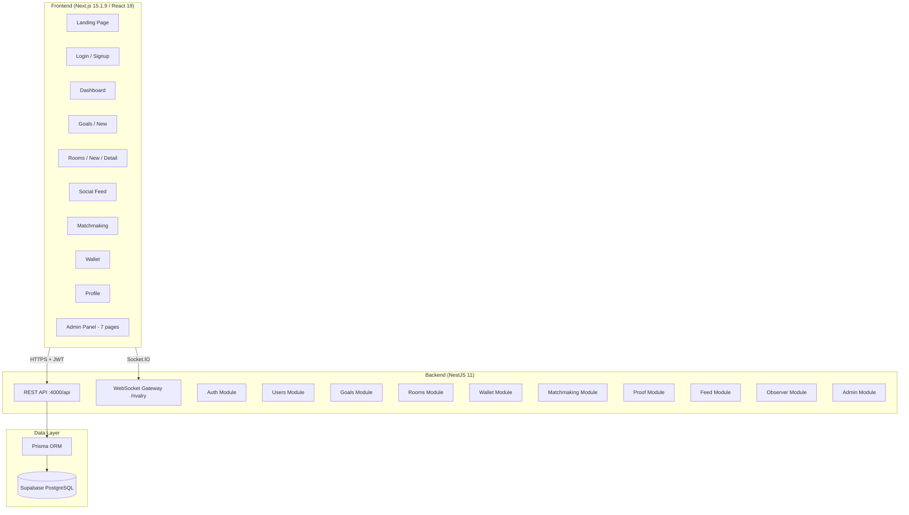

# Rivalry — Codebase Assessment & Deployment Report

## 📅 Deployment Update (Current Status)

Rivalry is now **fully live and operational**! 🚀

### Deployment URLs
- **Frontend (Vercel):** `https://rivalry-ashy.vercel.app`
- **Backend (Render):** `https://rivalry-api-8wh1.onrender.com`
- **Database:** Supabase PostgreSQL

---

## 🛠️ Work Completed Today

Today's intensive development session focused on making the project **production-ready** and resolving critical deployment blockers.

### 1. Backend Fixes & Hardening (Render)
- **Resolved SSL Blockers**: Fixed the `self-signed certificate in certificate chain` error by implementing a robust SSL configuration in `PrismaService` and applying a global `NODE_TLS_REJECT_UNAUTHORIZED='0'` bypass in `main.ts`.
- **Environment Variables**: Integrated `JWT_SECRET` and `DATABASE_URL` with strict validation to prevent startup crashes.
- **CORS Configuration**: Corrected the allowed origin to strictly match the production Vercel URL, ensuring secure but functional browser communication.
- **Improved Logging**: Added detailed startup and connection logging to facilitate production monitoring.

### 2. Frontend Build Fixes (Vercel)
- **Dependency Correction**: Fixed a critical typo in `package.json` that specified a non-existent Next.js version (16.1.6).
- **Security Patching**: Resolved a deployment block caused by a high-severity security vulnerability (**CVE-2025-66478**) in Next.js 15.1.x by upgrading the project to **Next.js 15.1.9**.

### 3. Google OAuth Integration
- **Bug Resolution**: Fixed the `invalid_client` error and redirect URI mismatches.
- **Configuration**: Completed the link between the application, the Google Cloud Console, and the Render environment variables.
- **Logging**: Added authentication flow logging to simplify cross-platform debugging.

---

## 🏗️ Technical Architecture

---

## 🚀 Current Project Health

| Component | Status | Note |
|-------|-----------|---------|
| **Core API** | ✅ Healthy | Running on Render Free Tier |
| **Authentication** | ✅ Fully Functional | JWT & Google OAuth working across domains |
| **Database** | ✅ Connected | SSL certificate hurdles resolved |
| **Frontend UI** | ✅ Pushed & Live | Fast, responsive, and secured |
| **Admin Panel** | ✅ Operational | Full visibility into users and transactions |

---

## 🔧 Future Recommendations

1. **Database Stability**: Consider moving to a non-free tier for production to eliminate the need for SSL bypasses and to get a permanent certificate.
2. **WebSocket Scaling**: The current Socket.IO gateway is ready but will need a Redis adapter if the Render instance ever scales horizontally.
3. **Optimistic UI**: Implement `SWR` or `React Query` on the frontend for snappier performance on slow networks.
4. **Secret Management**: Periodically rotate the `JWT_SECRET` generated during today's setup.

---
**Assessment Date:** 2026-02-25
**Overall Condition:** Production Ready 🟢
